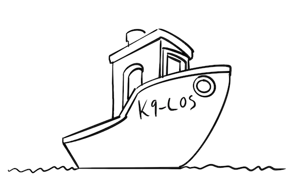

# k9-los-api
K9-los håndterer oppgave- og ledelsesstyring i k9. k9-sak, k9-tilbake og k9-punsj produserer hendelser som krever manuell interraksjon fra saksbehandler. K9-los produserer statistikk for å dekke behovet for oppgavestyring.

Oppgavestyrere definerer kriterier som ligger til grunn for køer som fordeler oppgaver etter prioritet til saksbehandlere.

# Bygge og kjøre lokalt
Start k9-verdikjede. Er avhengig av vtp, postgresql og nav-auth-mock.

Start klassen `no.nav.k9.K9LosDev` med parameter 

`-Djavax.net.ssl.trustStore=/Users/.../.modig/trustStore.jks -Djavax.net.ssl.keyStore=/Users/.../.modig/keyStore.jks -Djavax.net.ssl.trustStorePassword=changeit -Djavax.net.ssl.keyStorePassword=devillokeystore1234'`

